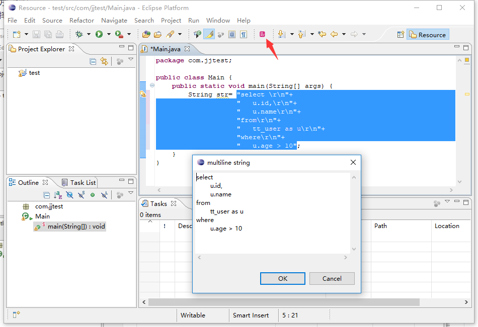

## eclipse 多行编辑插件
- 多行字符串的问题  
java不支持多行字符串，只能用+拼接，修改起来非常麻烦  
现在也有一些基于注释的方式来解决，但是涉及到编译的问题，感觉不是很稳

- 本方案解决  
选择多个拼接的字符串行，点击插件按钮，经过处理后，弹出简易框直接编辑，然后再回写，绿色无污染。

- 用法  
将
com.dyava.eclipse.multiline_string_x.jar
放入eclipse的plugins 目录即可